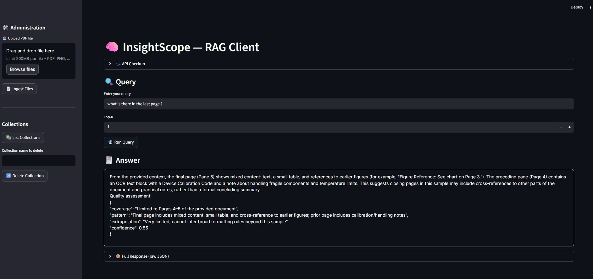

# 🚀 InsightScope

---

🧠🖼️✍️🎛️ Multimodal RAG and Evaluation Playground  
--- 
* 🦙 Tiny but mighty Document Intelligence pipeline… with an attitude. 😎  
* 🦙 LlamaIndex based RAG with insights
---
> *InsightScope is an end-to-end prototype that blends multimodal extraction, high-recall retrieval, and a lightweight judge layer into one clean, inspectable workflow.*

---

## 🧩 What This Project Does  
### **🧠 High-Recall Retrieval Engine**  
A lean retrieval system that actually *finds stuff*:
- Google `text-embedding-004` embeddings  
- Chroma vector store  
- LlamaIndex rewriting → dense search → synthesis  
- Optional reranking  
- Chunk → embed → index → retrieve → answer  

**Result:** You ask. It rewrites. It recalls. It answers.  
(And yes, it does it reliably.)  

---

### **🧩🖼️📊📷 Multimodal Document Intelligence Layer**  
PDFs, tables, OCR blocks, figures — all extracted via **Gemini Flash** and converted into structured JSON.

What we pull out:
- Text blocks  
- Tables → Markdown  
- Image regions → Captions  
- OCR sequences → Direct extraction  
- Per-page metadata  

**Result:** Your PDFs become queryable knowledge objects.  

---

### **🦺😎🛡️ Quality & Safety Harness**  
A small LLM-as-a-judge framework scoring:
- **Groundedness**  
- **Faithfulness**  
- **Safety / PII hints**  
- **Confidence**  

**Result:** Every answer comes with a tiny quality report card 📊  
(Yes, it will shame bad responses.)

---

## 💡 System Flow (In One Breath)
**Upload → Extract → Chunk → Embed → Index → Rewrite → Retrieve → Synthesise → Evaluate**

If you're reading this without breathing, you’re already one of us.  

---

## 💪 Current Strengths
- **Full multimodal pipeline**: tables, OCR, figures—all extracted cleanly  
- **Consistent high-recall RAG loop**  
- **Evaluation layer actually works** (sometimes too honest 😂)  
- **Structured logs for every phase**  
- **Super-light architecture**—no heavy preprocessing code  

---

## 🔧 Known Gaps / Future Improvements
1. **Finer chunk granularity** → Better retrieval precision  
2. **Deterministic evaluation** → Remove judge variability  
3. **Structured table normalization** → JSON cells, typed values  
4. **Automatic PII redaction** → Apply policies before embedding  
5. **Object-level embeddings** → Page vs Table vs Figure separation  

---

## 🚀 Running InsightScope
```bash
fastapi dev
```
Documents go to `tmp_ingest/`, chunks to `data/chunks.jsonl`, vectors into Chroma.

---

## 🧪 Regression Suite (Built‑In)
The system is verified against 5 core multimodal QA tasks:
- Purpose  
- Table extraction  
- Figure captioning  
- OCR block extraction  
- Metrics table  

Ensures **grounded_ness**, correctness, and page‑aligned retrieval.

---
## 🎯 Combined Final Showcase

- InsightScope becomes:

>  “A compact GenAI pipeline demonstrating high-recall RAG, 
multimodal understanding, and automated evaluation — built with 
LlamaIndex, Google GenAI embeddings/models, and ChromaDB.”

#### Architecturally strong, minimal, and buildable in 1–2 days.

---

# InsightScope — RAG Client UI Overview

This section documents the high-level structure and functional behavior of the **InsightScope RAG Client UI**.

---

## 📸 UI Snapshot




---

# 🧭 Functional Breakdown of the UI

The InsightScope Streamlit interface is organized into two major regions:

- **Left Sidebar** (Administration & Data Controls)  
- **Main Panel** (User interactions, querying, results)

Each element is non-invasive, declarative, and directly mapped to REST endpoints exposed by the InsightScope backend.

---

## 🛠️ Sidebar — Administration Panel

### **1. Upload PDF File**
- Drag-and-drop zone + “Browse files” button.  
- Accepts **single PDF/PNG/JPG/JPEG file**.  
- Prepares the file for ingestion via:
  ```
  POST /api/ingest/upload
  ```

### **2. Ingest Files**
- Sends the selected file to the backend ingestion pipeline.
- Triggers:
  - PDF/image extraction  
  - Chunking  
  - Google GenAI embeddings  
  - ChromaDB indexing  

### **3. Collections Management**
#### **List Collections**
- Fetches available vector store collections.
  ```
  GET /api/ingest/collections
  ```

#### **Collection Name Field**
- Free-text input specifying which collection to delete.

#### **Delete Collection**
- Deletes the given collection.
  ```
  POST /api/ingest/delete?collection_name=<name>
  ```

---

## 🏥 Main Panel — User Interaction Surface

### **A. API Checkup (Expander)**
- Provides a quick backend ping.
- Calls health endpoint:
  ```
  GET /
  ```

---

### **B. Query Section**
#### **1. Query Input**
- Accepts user questions for the RAG pipeline.

#### **2. Top-K Selector**
- Controls retrieval depth in ChromaDB.

#### **3. Run Query**
- Triggers complete RAG chain:
  - Query rewriting  
  - High-recall retrieval  
  - Synthesis  
  - Evaluation  
- Endpoint:
  ```
  POST /api/query/analyse
  ```

---

## 📄 Answer Display

### **Primary Answer Block**
- Clean, styled Markdown box displaying only the final “answer” field.

### **Full Response (raw JSON)** — *Collapsible*
- Shows the full backend response including:
  - original query  
  - rewritten query  
  - synthesized answer  
  - quality evaluation  
  - grounding scores  
  - confidence & metadata  

Used for debugging, audit logging, and evaluation.

---

# 🔁 End-to-End Flow Summary

```
Upload → Ingest → Index → Query → Answer → Inspect Metadata
```

This ensures:
- Clear separation of ingestion & querying  
- High visibility into pipeline stages  
- Non-invasive UX for development, debugging, and demos  

---

# 📎 Notes
- UI architecture is fully declarative.  
- Styling enhancements remain optional and isolated.  
- Layout is dark-mode compatible as shown.
- Ui is mostly generated from LLMs

---

# 🚢🐳 Docker Deployment Guide 🚢🐳

This project packages **FastAPI** (backend) and **Streamlit** (frontend) into a **single Docker container**.
FastAPI runs internally on `127.0.0.1:8000`, while Streamlit is the only exposed service (`8501`).
The container auto-starts both services without an entrypoint script.

---

## 🚢 Build the Docker Image

```bash
docker build -t insightscope:latest .

docker run -d \
  --name insightscope \
  -p 8501:8501 \
  -e GOOGLE_API_KEY=<YOUR_GENAI_API_KEY> \
  -e OPENAI_API_KEY=<YOUR_OPENAI_API_KEY> \
  insightscope:latest
```


## 🐋 How This Dockerfile Was Customized

- Runs FastAPI + Streamlit inside one container using a dual-process CMD.
- FastAPI stays internal (127.0.0.1) for isolation; only Streamlit is exposed.
- Lightweight python:3.11-slim image.
- Environment-variable–driven configuration for ports and script paths.
